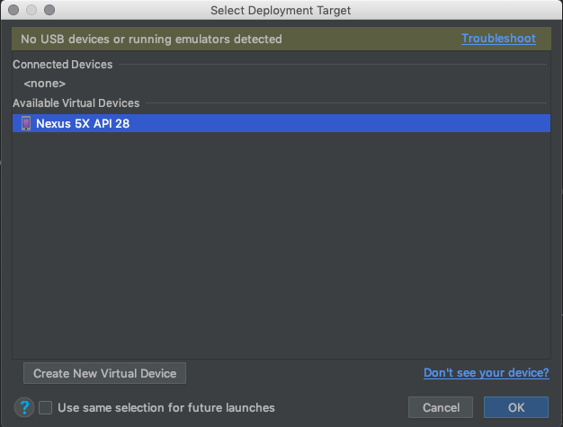

# IO3040-Software-Workshop-0

# Workshop 0
## Android Studio and testing your App

#### Setup and Configuration

##### Java Development Kit (Java SE)
We will program our app with JAVA, and as such, first we need to install the JDK. The most current version is 11.0.1(LTS). Note that you need to accept the License agreement.

[Download Link](https://www.oracle.com/technetwork/java/javase/downloads/jdk11-downloads-5066655.html)

###### Windows
For windows, you can download a the executable(.exe).
Once we have the file, we can simply double-click it, and follow the instructions. After installation you may delete the .exe file.

###### MacOS
For MacOS, you can download the executable(.dmg).
Once we have the file , we can simply double-click it, and follow the instructions. After installation you may delete the .dmg file.

##### Android studio

We will use the IDE (integrated development environment) - Android studio. It contains all the tools you will need for making(and testing) your app.
We're using the most recent version (3.2.1). [Download Link](https://developer.android.com/studio/)

###### Windows
Once we have downloaded the file (.exe), we can simply double-click it, and follow the installation wizard with default options. [Video guide](https://developer.android.com/studio/videos/studio-install-windows.mp4). After installation you may delete the .exe file.

###### MacOS
Once we have downloaded the file(.dmg) , we can simply double-click it, drag the icon into the applications wizard, and follow the instruction wizard. [Video guide](https://developer.android.com/studio/videos/studio-install-mac.mp4). After installation you may delete the .dmg file.

## Testing your app
There are 2 ways you can test your app in android studio. You can either use an android phone and test it there, or use an emulator.

### Android phone
First of all, you need to enable usb debugging on the phone, which needs developer options.
[Instructions.](https://developer.android.com/studio/debug/dev-options)
Then, with enabled USB debugging, connect the phone through usb to the computer, and on Android Studio, click run,  , choose the android mobile phone, and press ok.

(a pop up might appear for you to install the sdk platform for your phone, in which case, you need to install it.)

### Emulator
To run on an emulated phone, you need to first create it. Mind you, that the more recent and powerful the phone you choose to emulate is,  the slower it will run on Android Studio.

On Android Studio, start by clicking run,  , and select the "Create New Virtual Device" option on the wizard that appears:

Following this, you can proceed with selecting a device (keep performance in mind though):

After this, you need to choose and download a system to run on your emulated phone:

Finally, you can change the name of the emulated phone, if you want to do so, and, optionally, customize any further options.

 After this you can access it by simply clicking the run button , selecting the emulated device and pressing ok:

